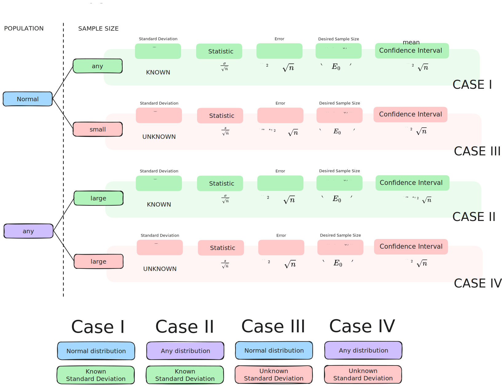

# Types of Estimation

> [!note] Point estimation
> A single number is calculated to estimate the parameter. 
> 
> > [!definition] Point estimator
> > Rule or formula describing calculation
> 
> > [!definition] Point estimate
> > Resulting number

> [!note] Interval estimation
> Two numbers are calculated to form an interval within which parameter is expected to lie.

# Point Estimation

> [!definition] Estimator
> An estimator is a rule, usually expressed as a formula, on how to calcualte an estimate, based on information in the sample.

> [!definition] Unbiased estimator
> Let $\hat \Theta$ be an estimator of $\theta$. 
> Then, $\hat \Theta$ is a random variable based on the sample.
> 
> If $E(\hat \Theta) = \theta$, $\hat \Theta$ is an unbiased estimator of $\theta$.

By definition, an unbiased estimator has a mean value that is equal to the value of a parameter.

## Maximum Error of Estimate

> [!note] Difference between estimator and true value of the parameter
> 
> $$
> | \bar{X} - \mu|
> $$
> 
> If population is normal, or if $n$ is large, $\frac{\bar X - \mu}{\frac{\sigma}{\sqrt{n}}}$ follows a standard normal or an approximately standard normal distribution.

> [!definition] $z_{\alpha}$
> $z_{\alpha}$ is the number with an upper-tail probability of $\alpha$ for standard normal distribution $Z$.
> $$
>P(Z>z_{\alpha}) = \alpha 
> $$

$$
\begin{aligned}
P\left(-z_\frac{\alpha}{2} \leq \frac{\bar X - \mu}{\frac{\sigma}{\sqrt{n}}} \leq z_\frac{\alpha}{2}\right)&= 1-\alpha \\
P\left(\frac{|\bar X - \mu|}{\frac{\sigma}{\sqrt{n}}}\leq z_\frac{\alpha}{2}\right)&= 1-\alpha 
\end{aligned}
$$
We can then derive the maximum error of estimate.

> [!definition] Maximum error of estimate
> $$
> E = z_\frac{\alpha}{2} \times \frac{\sigma}{\sqrt{n}}
> $$

## Determination of Sample Size

> [!note] Motivation
> Given a maximum error $E_0$, we want to know what the minimum sample size should be.

$$
\begin{aligned}
z_\frac{\alpha}{2} \frac{\sigma}{\sqrt{n}} & \leq E_{0} \\
n & \geq (\frac{z_\frac{\alpha}{2}\times\sigma}{E_{0}})^2
\end{aligned}
$$

# Confidence Intervals

> [!definition] Confidence interval
> A rule for calculating from the sample, an interval $(a,b)$ in which you are fairly certain the parameter of interest lies in.
> 
> > [!definition] Degree of confidence/confidence level
> > Quantifies the certainty mentioned above
> 
> $$ P(a < \mu < b) = 1 - \alpha $$
> $(a,b)$ is called the $(1, \alpha)$ confidence interval.

## Mean

### Case I: $\sigma$ known, data normal

$$
\begin{aligned}
P\left(-z_\frac{\alpha}{2} \leq \frac{\bar X - \mu}{\frac{\sigma}{\sqrt{n}}} \leq z_\frac{\alpha}{2}\right) &= 1 - \alpha \\
P\left(\bar{X} - z_\frac{\alpha}{2} \frac{\sigma}{\sqrt{n}} \leq \mu \leq \bar{X} + z_\frac{\alpha}{2} \frac{\sigma}{\sqrt{n}}\right) & = 1 - \alpha \\
\\
\bar X \pm z_\frac{\alpha}{2} \frac{\sigma}{\sqrt{n}} = (\bar{X} - z_\frac{\alpha}{2} \frac{\sigma}{\sqrt{n}}, \bar{X} + z_\frac{\alpha}{2} \frac{\sigma}{\sqrt{n}})
\end{aligned}
$$
The following is a $(1 - \alpha)$ confidence interval.

### Case II: $\sigma$ known, data any

Similar to case I:

$$
\begin{aligned}
P\left(-z_\frac{\alpha}{2} \leq \frac{\bar X - \mu}{\frac{\sigma}{\sqrt{n}}} \leq z_\frac{\alpha}{2}\right) &= 1 - \alpha \\
P\left(\bar{X} - z_\frac{\alpha}{2} \frac{\sigma}{\sqrt{n}} \leq \mu \leq \bar{X} + z_\frac{\alpha}{2} \frac{\sigma}{\sqrt{n}}\right) & = 1 - \alpha \\
\\
\bar X \pm z_\frac{\alpha}{2} \frac{\sigma}{\sqrt{n}} = (\bar{X} - z_\frac{\alpha}{2} \frac{\sigma}{\sqrt{n}}, \bar{X} + z_\frac{\alpha}{2} \frac{\sigma}{\sqrt{n}})
\end{aligned}
$$
The following is a $(1 - \alpha)$ confidence interval.

### Case III: $\sigma$ unknown, data normal

$$
\begin{aligned}
P(-t_{n-1;\frac{\alpha}{2}} \leq \frac{\bar{X} - \mu}{\frac{S}{\sqrt{n}}} \leq t_{n-1;\frac{\alpha}{2}}) &= 1-\alpha \\
P\left(\bar{X} - t_{n-1;\frac{\alpha}{2}}\frac{S}{\sqrt{n}} < \mu < \bar{X} + t_{n-1;\frac{\alpha}{2}}\frac{S}{\sqrt{n}}\right) &= 1 - \alpha \\
\bar{X} \pm t_{n-1;\frac{\alpha}{2}}\frac{S}{\sqrt{n}} = (\bar{X} - t_{n-1;\frac{\alpha}{2}}\frac{S}{\sqrt{n}}, \bar{X} + t_{n-1;\frac{\alpha}{2}}\frac{S}{\sqrt{n}})
\end{aligned}
$$

The following is a $(1 - \alpha)$ confidence interval.

### Case IV: $\sigma$ unknown, data any

$$
\begin{aligned}
P\left(-z_\frac{\alpha}{2} \leq \frac{\bar X - \mu}{\frac{s}{\sqrt{n}}} \leq z_\frac{\alpha}{2}\right) &= 1 - \alpha \\
P\left(\bar{X} - z_\frac{\alpha}{2} \frac{s}{\sqrt{n}} \leq \mu \leq \bar{X} + z_\frac{\alpha}{2} \frac{s}{\sqrt{n}}\right) & = 1 - \alpha \\
\\
\bar X \pm z_\frac{\alpha}{2} \frac{s}{\sqrt{n}} = (\bar{X} - z_\frac{\alpha}{2} \frac{s}{\sqrt{n}}, \bar{X} + z_\frac{\alpha}{2} \frac{s}{\sqrt{n}})
\end{aligned}
$$
The following is a $(1 - \alpha)$ confidence interval.

## Interpreting Confidence Intervals

When $\bar{X} \pm E$ has probability $(1 - \alpha)$ of containing $\mu$,
- everytime we take samples and construct the interval estimator, a different confidence interval is computed. 
- some confidence intervals contains $\mu$, and some don't.

Since $\mu$ is not known, 
- there is no way to determine if a confidence interval contains $\mu$ or not.
- if the procedure is repeated many times, about $(1-\alpha)$ of the many confidence intervals gotten will contain the true parameter. 
	- ~ if we repeat the procedure to get 0.95 confidence intervals, 0.95 of the confidence intervals computed will contain the true parameter.

# Experimental Design

To compare two populations, a number of observations from each population need to be collected.

> [!definition] Experimental design
> Manner in which samples from populations are collected.

Basic designs
- independent samples (complete randomisation)
- matched pairs samples (randomisation between matched pairs)

## Independent Samples: Known and Unequal

> [!note] Assumptions
> 1. A random sample of size $n_{1}$ from population 1 with mean $\mu_{1}$ and variance $\sigma_{1}^{2}$
> 2. A random sample of size $n_{2}$ from population 2 with mean $\mu_{2}$ and variance $\sigma_{2}^{2}$
> 3. Both samples are independent
> 4. Population variances are known and not the same $\sigma^{2}_{1} \neq \sigma^{2}_{2}$
> 5. Either one of the following conditions holds:
> 	- Both populations are normal
> 	- Both samples are large: $n_{1} \geq 30, n_{2} \geq 30$

Consider $X_{1},...,X_{n}$ and $Y_{1},...,Y_{n}$ as random samples from the two populations of interest. 
$$
\bar X = \frac{1}{n_{1}}\sum\limits^{n_{1}}_{i=1}X_{i} \text{ and } \bar Y = \frac{1}{n_{2}}\sum\limits^{n_{2}}_{i=1}Y_{i}
$$
Then, 
$$
E(\bar X) = \mu_{1}, V(\bar X)= \frac{\sigma^{2}_{1}}{n_{1}}, E(\bar Y) = \mu_{2}, V(\bar X)= \frac{\sigma^{2}_{2}}{n_{2}}
$$

Thus,
$$
E(\bar X - \bar Y) = \mu_{1} - \mu_{2} = \delta 
$$

and using the independence assumption,
$$
V(\bar X - \bar Y) = \frac{\sigma_{1}^{2}}{n_{1}} - \frac{\sigma_{2}^{2}}{n_{2}}
$$

When
- populations are normal OR
- both samples are large  $n_{1} \geq 30, n_{2} \geq 30$ (using CLT)

$$
\bar X - \bar Y \sim N(\mu_{1} - \mu_{2}, \frac{\sigma_{1}^{2}}{n_{1}} + \frac{\sigma_{2}^{2}}{n_{2}})
$$

$$
Z = \frac{(\bar X - \bar Y)- (\mu_{1} - \mu_{2})}{\sqrt{\frac{\sigma_{1}^{2}}{n_{1}} + \frac{\sigma_{2}^{2}}{n_{2}}}} \sim N(0,1)
$$

Thus, our point of interest is the following difference $\delta$:

$$
\delta = \mu_{1} - \mu_{2}
$$

with confidence $100(1-\alpha)\%$ for any $0 < a < 1$.

> [!note] Getting the confidence interval

If $\sigma^{2}_{1}, \sigma^{2}_{2}$ are known, we get:
$$
P\left(\Biggl|\frac{(\bar X - \bar Y)- (\mu_{1} - \mu_{2})}{\sqrt{\frac{\sigma_{1}^{2}}{n_{1}} + \frac{\sigma_{2}^{2}}{n_{2}}}}\Biggr| < z_\frac{a}{2}\right)= 1 - \alpha
$$

> [!important] Confidence interval for difference, with known and unequal variances
> Thus, the $100(1-\alpha)\%$ confidence interval for $\mu_{1} - \mu_{2}$ is:
> $$
> (\bar X - \bar Y) \pm z_\frac{a}{2} \sqrt{\frac{\sigma^{2}_{1}}{n_{1}} + \frac{\sigma^{2}_{2}}{n_{2}}}
> $$

## Independent Samples: Large, with Unknown Variances

> [!note] Assumptions
> 1. A random sample of size $n_{1}$ from population 1 with mean $\mu_{1}$ and variance $\sigma_{1}^{2}$
> 2. A random sample of size $n_{2}$ from population 2 with mean $\mu_{2}$ and variance $\sigma_{2}^{2}$
> 3. Both samples are independent
> 4. Population variances are unknown and not the same $\sigma^{2}_{1} \neq \sigma^{2}_{2}$
> 5. Both samples are large: $n_{1} \geq 30, n_{2} \geq 30$

As $\sigma_{1}, \sigma_{2}$ are unknown, let:
$$
S^{2}_{1}= \frac{1}{n_{1}-1}\sum\limits^{n_{1}}_{n=1}(X_{i}-\bar{X})^{2}, S^{2}_{2}= \frac{1}{n_{2}-1}\sum\limits^{n_{2}}_{n=1}(Y_{i}-\bar{Y})^{2} 
$$

Now, using the sample variances $S^{2}_{1}, S^{2}_{2}$:

$$
\bar X - \bar Y \sim N(\mu_{1} - \mu_{2}, \frac{S_{1}^{2}}{n_{1}} + \frac{S_{2}^{2}}{n_{2}})
$$

$$
Z = \frac{(\bar X - \bar Y)- (\mu_{1} - \mu_{2})}{\sqrt{\frac{S_{1}^{2}}{n_{1}} + \frac{S_{2}^{2}}{n_{2}}}} \sim N(0,1)
$$

> [!important] Confidence interval for difference, with large sample size and unequal variances
> Thus, the $100(1-\alpha)\%$ confidence interval for $\mu_{1} - \mu_{2}$ is:
> $$
> (\bar X - \bar Y) \pm z_\frac{a}{2} \sqrt{\frac{S^{2}_{1}}{n_{1}} + \frac{S^{2}_{2}}{n_{2}}}
> $$

## Independent Samples: Small, with Equal Variances

> [!remark] Equal Variance Assumption
> In real applications, equal variance assumption is usually unknown and needs to be checked.

> [!note] Assumptions
> 1. A random sample of size $n_{1}$ from population 1 with mean $\mu_{1}$ and variance $\sigma_{1}^{2}$
> 2. A random sample of size $n_{2}$ from population 2 with mean $\mu_{2}$ and variance $\sigma_{2}^{2}$
> 3. Both samples are independent
> 4. Population variances are unknown and the same $\sigma^{2}_{1} = \sigma^{2}_{2}$
> 5. Both samples are small: $n_{1} < 30, n_{2} < 30$
> 6. Both populations are normally distributed

Based on equal variance assumption, as well as normally distributed population:
$$
Z = \frac{(\bar X - \bar Y)- (\mu_{1} - \mu_{2})}{\sigma\sqrt{\frac{1}{n_{1}} + \frac{1}{n_{2}}}} \sim N(0,1)
$$

Since both variances are equal, we can estimate $\sigma^{2}$, using both $S^{2}_{1}$ or $S^{2}_{2}$. They are both unbiased estimators.

> [!definition] Pooled estimator $S^{2}_{p}$
> $$
> S^{2}_{p}= \frac{(n_{1}-1)S^{2}_{1}+(n_{2}-1)S^{2}_{2}}{n_{1}+n_{2}-2} 
> $$

Using the pooled estimator, the statistic:
$$
T = \frac{(\bar X - \bar Y)- (\mu_{1} - \mu_{2})}{S_{p}\sqrt{\frac{1}{n_{1}} + \frac{1}{n_{2}}}} \sim t_{n_{1}+n_{2}-2}
$$

We then get the probability:
$$
P(\biggl|\frac{(\bar X - \bar Y)- (\mu_{1} - \mu_{2})}{S_{p}\sqrt{\frac{1}{n_{1}} + \frac{1}{n_{2}}}}\biggr| < t_{n_{1}+n_{2}-2;\frac{a}{2}})
$$

> [!important] Confidence interval for difference, with small sample size and equal variances
> Thus, the $100(1-\alpha)\%$ confidence interval for $\mu_{1} - \mu_{2}$ is:
> $$
> (\bar X - \bar Y) \pm t_{n_{1}+n_{2}-2;\frac{a}{2}}S_{p}\sqrt{\frac{1}{n_{1}} + \frac{1}{n_{2}}}
> $$

> [!remark] Equal Variance Assumption
> In real applications, equal variance assumption is usually unknown and needs to be checked.

> [!note] Assumptions
> 1. A random sample of size $n_{1}$ from population 1 with mean $\mu_{1}$ and variance $\sigma_{1}^{2}$
> 2. A random sample of size $n_{2}$ from population 2 with mean $\mu_{2}$ and variance $\sigma_{2}^{2}$
> 3. Both samples are independent
> 4. Population variances are unknown and the same $\sigma^{2}_{1} = \sigma^{2}_{2}$
> 5. Both samples are small: $n_{1} < 30, n_{2} < 30$
> 6. Both populations are normally distributed

Based on equal variance assumption, as well as normally distributed population:
$$
Z = \frac{(\bar X - \bar Y)- (\mu_{1} - \mu_{2})}{\sigma\sqrt{\frac{1}{n_{1}} + \frac{1}{n_{2}}}} \sim N(0,1)
$$

Since both variances are equal, we can estimate $\sigma^{2}$, using both $S^{2}_{1}$ or $S^{2}_{2}$. They are both unbiased estimators.

> [!definition] Pooled estimator $S^{2}_{p}$
> $$
> S^{2}_{p}= \frac{(n_{1}-1)S^{2}_{1}+(n_{2}-1)S^{2}_{2}}{n_{1}+n_{2}-2} 
> $$

Using the pooled estimator, the statistic is similar, but due to CLT, follows a Normal distribution instead.
$$
T = \frac{(\bar X - \bar Y)- (\mu_{1} - \mu_{2})}{S_{p}\sqrt{\frac{1}{n_{1}} + \frac{1}{n_{2}}}} \sim N(0,1)
$$

We then get the probability:
$$
P(\biggl|\frac{(\bar X - \bar Y)- (\mu_{1} - \mu_{2})}{S_{p}\sqrt{\frac{1}{n_{1}} + \frac{1}{n_{2}}}}\biggr| < z_{\frac{a}{2}})
$$

> [!important] Confidence interval for difference, with large sample size and equal variances
> Thus, the $100(1-\alpha)\%$ confidence interval for $\mu_{1} - \mu_{2}$ is:
> $$
> (\bar X - \bar Y) \pm z_{\frac{a}{2}}S_{p}\sqrt{\frac{1}{n_{1}} + \frac{1}{n_{2}}}
> $$

# Dependent Samples: Paired Data

> [!note] Assumptions
> 1. $(X_{1}, Y_{1}), ... (X_{n}, Y_{n})$ are matched pairs, with $X_{1},...,X_{n}$ being a random sample from population 1, and $Y_{1},...,Y_{n}$ being a random sample from population 2.
> 2. $X_{i}, Y_{i}$ are dependent
> 3. $(X_{i}, Y_{i})$ and $(X_{j}, Y_{j})$ are independent for any $i \neq j$
> 4. For matched pairs, define $D_{i}= X_{i}-Y_{i}$
> 	- $\mu_{D}= \mu_{1}-\mu_{2}$
> 5. $D_{1},...,D_{n}$ is now a random sample from a single population, with mean $\mu_{D}$, variance $\sigma^{2}_{D}$

We can then consider the technique used for a single population:
$$
\bar{D}=\frac{\sum\limits^{n}_{i=1}D_{i}}{n}, S^{2}_{D}= \frac{\sum\limits^{n}_{i=1}(D_{i}-\bar{D})^2}{n-1}
$$
Then, we get the statistic:
$$
T = \frac{\bar{D}-\mu_{D}}{{\frac{S_D}{\sqrt{n}}}}
$$

Then, using the CLT:
$$
T \sim t_{n-1} \text{ if } n < 30, \text{ population is normal}
$$
or
$$
T \sim N(0,1)
$$

> [!important] Confidence interval for difference of paired samples, with small sample size
> Thus, the $100(1-\alpha)\%$ confidence interval for $\mu_{1} - \mu_{2}$ is:
> $$
> \bar d \pm t_{n-1;\frac{a}{2}}\frac{s_{D}}{\sqrt{n}}
> $$

> [!important] Confidence interval for difference of paired samples, with large sample size
> Thus, the $100(1-\alpha)\%$ confidence interval for $\mu_{1} - \mu_{2}$ is:
> $$
> \bar d \pm z_{\frac{a}{2}}\frac{s_{D}}{\sqrt{n}}
> $$

