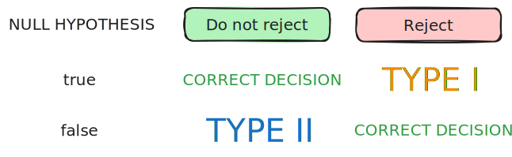

> [!note] The five main steps
> 1. Set hypotheses: null $H_{0}$ and alternative $H_{1}$
> 2. Set level of significance
> 3. Identify test statistic, distribution, and rejection criteria
> 4. Compute observed test statistic value
> 5. Conclude

# Step 1: Set hypothesis

In general, the position of null hypothesis is adopted - it is typically the default assumption.

We usually let hypothesis that we want to prove be the alternative hypothesis.

> [!note] Possible outcomes
> Reject $H_{0}$ or fail to reject $H_{0}$

Type of test:
- one-sided
- two-sided

# Step 2: Level of significance

Outcomes:
- Reject $H_{0}$, conclude $H_{1}$
- Do not reject $H_{0}$, conclude $H_{1}$

> [!definition] Type I error
> Rejecting the null hypothesis $H_{0}$ when it is true
> 
> > [!definition] Level of significance
> > $$
> > \alpha = P(\text{type 1 error}) = P(\text{reject } H_{0} | H_{0} \text{ is true})
> > $$

> [!definition] Type II error
> Not rejecting null hypothesis $H_{0}$ when it is false
> 
> > [!definition] Power
> > Power of the test refers to the value $1 - \beta$, where
> > $$
> > \beta = P(\text{type 2 error}) = P(\text{do not reject } H_{0} | H_{0} \text{ is false})
> > $$

> [!note] Type I error is considered a serious error.

# Step 3: Test statistic, distribution, rejection

Select a suitable test statistic - it quantifies the likeliness of observing the sample, assuming null hypothesis holds. 

The $\alpha$ allows to find a decision rule such that it divides the set of all possible values of the test statistic into two regions, one being the rejection region (or critical region), and the other the acceptance region.

# Step 4 & 5: Calculation and Conclusion

Once sample is taken, we check whether the obtained value of the test statistic is within rejection region:
- if it is, sample too improbable assuming $H_0$ holds, hence $H_0$ rejected.
- if it is not, we failed to reject $H_{0}$

> [!important] We cannot prove $H_0$ is true: use the term *fail to reject $H_0$*

