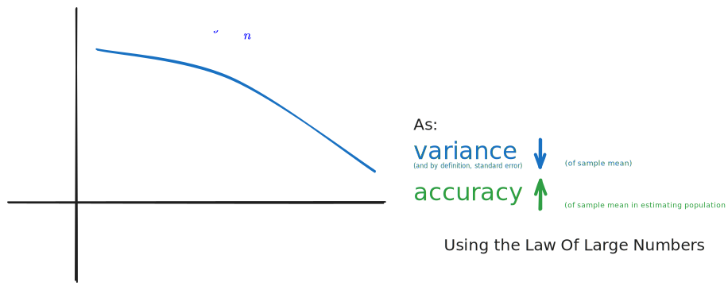
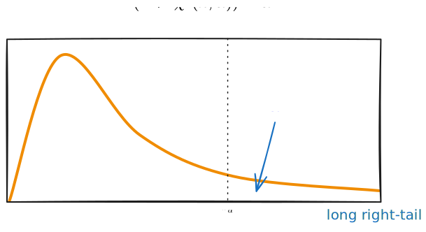
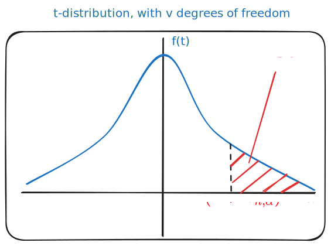

> [!definition] Population
> The totality of all possible outcomes or observations of a survey of experiment is a population

> [!definition] Sample
> Any subset of a population

> [!definition] Finite population
> Consists of a finite number of elements

> [!definition] Infinite population
> One that consists of an infinitely (countable and uncountable) large number of elements.

# Random Sampling

> [!definition] Simple random sample (SRS)
> 
> A set of $n$ members taken from a given population is called a sample of size $n$.
> 
> A simple random sample (SRS) of $n$ members is a sample that is chosen such that every subset of $n$ observations of the population has the same probability of being selected.

## Sampling from an Infinite Population

> [!definition] Simple random sample: Infinite population
> 
> Let $X$ be a random variable with certain probability distribution $f_X$.
> 
> Let $X_{1},...X_{n}$ be $n$ independent random variables each having the same distribution as $X$. Then $X_{1},..,X_{n}$ is called a random sample of size $n$ from a population with distribution $f_{X}$.
> 
> The joint probability function of ($X_{1}, ..., X_{n}$) is given by:
> $$
> f_{X_{1}, ..., X_{n}}(x_1,...,x_{n})= f_{X_{1}}(x_1)...f_{X_{n}}(x_n)
> $$

# Sampling Distribution of Sample Mean

> [!definition] Statistic
> Suppose a random sample of $n$ observations ($X_{1},...,X_{n}$) has been taken. A function of $(X_{1},...,X_{n})$ is called a statistic.
> 
> > [!example] Sample mean $\bar{X}$, sample variance $S^{2}$.

> [!definition] Sampling Distribution
> The probability distribution of a statistic is called a sampling distribution

> [!theorem] Theorem 6
> 
> Related to the center and spread of sampling distribution.
> 
> For random samples of size $n$ taken from an infinite population with mean $\mu_{X}$ and variance $\sigma^2_X$, the sampling distribution of the sample mean $\bar X$ has mean $\mu_{X}$ and variance $\frac{\sigma^{2}_{X}}{n}$.
> 
> $$
>\mu_{\bar{X}}=E(\bar{X}) = \mu_{X}\text{ and } \sigma^{2}_{\bar{X}}= V(\bar{X}) = \frac{\sigma^{2}_{X}}{n}
> $$ 

The expectation of the sample mean is equal to the population mean -
$$
E(\bar{X}) = \mu_X
$$

In the long run, $\bar{X}$ does not introduce any systematic bias as an estimator of $\mu_{X}$, thus can serve as a valid estimator of it.

For an infinite population, as $n$ gets larger and larger, $\frac{\sigma^{2}_{X}}{n}$, the variance of $\bar{X}$ becomes smaller and smaller: the accuracy of the estimator becomes better.

> [!definition] Standard error
> The spread of the sampling distribution is described by its standard deviation (also known as standard error).
> 
> It is denoted $\sigma_{\bar{X}}$.

The standard error can be understood intuitively by interpreting it as such:
it describes how much $\bar{x}$ tends to **vary** from sample to sample of size $n$.

> [!theorem] Law of Large Numbers (LLN)
> If $X_{1}, ..., X_{n}$ are independent random variables with the same mean $\mu$ and variance $\sigma^{2}$, then for any $\epsilon \in \mathbb{R},$ 
> 
> $$
> P(|\bar{X} -\mu| > \epsilon) \rightarrow 0 \text{ as } n \rightarrow \infty 
> $$
> 

It is increasingly likely that $\bar{X}$ is close to $\mu_{X}$, as $n$ gets larger.

# Central Limit Theorem

> [!theorem] Central Limit Theorem (CLT)
> 
> If $\bar{X}$ is the mean of a random sample of size $n$ taken from a population having mean $\mu$ and finite variance $\sigma^2$, then as $n \rightarrow \infty$:
> 
> $$
> \frac{\bar{X} - \mu}{\frac{\sigma}{\sqrt{n}}} \rightarrow Z \sim N(0,1)
> $$
> Equivalently, this means:
> $$
> \bar{X} \rightarrow N(\mu, \frac{\sigma^{2}}{n})
> $$

The CLT states that, under rather general condiitions, for large $n$, sums and means of random samples drawn from a population follows the normal distribution closely. 
(If the random sample comes from a normal population, $\bar{X}$ is normally distributed, regardless.)

> [!note] Rule of thumb
> The mean of a large number of independent samples will have an approximately normal distribution.
> 
> - If population is symmetric with no outliers, good approximation to normality appears after as few as 15-20 samples.
> - If population is moderately skewed, such as exponential or $\chi^2$, then it can take between 30-50 samples before getting a good approximation
> - If population is extremely skewed, CLT may not be appropriate even with a lot of samples.

# Other Sampling Distributions

## $x^{2}$ Distribution

> [!definition] $\chi^{2}$ Distribution
> Let $Z$ be a standard normal random variable. A random variable with the same distribution as $Z^{2}$ is called a $\chi^{2}$ random variable with one degree of freedom.
> 
> Let $Z_{1},...,Z_{n}$ be $n$ independent and identically distributed standard normal random variables. A random variable with the same distribution as $Z^{2}_{1} + ... + Z^{2}_{n}$ is called a $x^{2}$ random variable with $n$ degrees of freedom.
>
>We denote a $\chi^2$ random variable with $n$ degrees of freedom as $\chi^2(n)$.

Properties of the $\chi^{2}$ distribution:
1. If $Y \sim \chi^2(n)$, then $E(Y) = n$, and $V(Y) = 2n$
2. For large $n$, $\chi^{2}(n)$ is approximately $N(n, 2n)$
3. If $Y_{1}, Y_{2}$ are independent $\chi^{2}$ random variables with $m, n$ degrees of freedom respectively, then $Y_{1}+Y_{2}$ is a $\chi^{2}$ random variable with $m + n$ degrees of freedom.
4. The $\chi^{2}$ distribution is a family of curves, each determined by degrees of freedom $n$. All density functions have a long right tail.

### Sampling distribution of $\frac{(n-1)S^{2}}{\sigma^{2}}$

The sampling distribution of the random variable $S^2$ has little practical application. Thus, the sampling distribution of $\frac{(n-1)S^{2}}{\sigma^{2}}$ when $X_{i}\sim N(\mu, \sigma^{2})$ is considered instead.

> [!theorem] 
> If $S^{2}$ is the variance of a random sample of size $n$ taken from a normal population having the variance $\sigma^{2}$, then the random variable:
> $$
>\frac{(n-1)S^{2}}{\sigma^{2}} = \sum\limits^{n}_{i={1}}\frac{(X_{i}-\bar{X})^{2}}{\sigma^{2}} 	
> $$
> 
>has a $\chi^{2}$ distribution with $n-1$ degrees of freedom.

## $t-$Distribution (Student's $t-$distribution)

> [!definition] $t-$Distribution
> 
> Suppose $Z \sim N(0,1)$ and $U \sim \chi^{2}(n)$. If $Z$ and $U$ are independent, then
> $$
> T = \frac{Z}{\sqrt{\frac{U}{n}}}
> $$
> follows the $t$-distribution with $n$ degrees of freedom.

Properties:
- $t-$distribution with $n$ degrees of freedom is denoted $t(n)$
- $t-$ distribution approaches $N(0,1)$ as parameter $\rightarrow \infty$. When $n \geq 30$, we can replace it by $N(0,1)$.
- If $T \sim t(n)$, then $E(T) = 0$ and $V(T) = \frac{n}{n-2}$ for $n > 2$.
- Graph of $t-$distribution is symmetric about the vertical axis and resembles the graph of the standard normal distribution.

> [!theorem] Theorem 15
> 
> If $X_{1},...,X_{n}$ are independent and identically distributed normal random variables with mean $\mu$ and variance $\sigma^{2}$ then
> 
> $$
> \frac{\bar{X}-\mu}{\frac{S}{\sqrt{n}}}
> $$
> follows a $t-$distribution with $n-1$ degrees of freedom.

## $F-$Distribution

> [!definition] $F-$Distribution
> Suppose $U \sim \chi^2(m)$ and $V \sim \chi^2(n)$ are independent. Then the distribution of the random variable
> $$
> F = \frac{{\frac{U}{m}}}{{\frac{V}{n}}} 
> $$
> is called a $F-$distribution with $(m,n)$ degrees of freedom.

Properties:
- The $F-$distribution with $(m,n)$ degrees of freedom is denoted by $F(m,n)$
- If $X \sim F(m,n)$, then
$$
E(X) = \frac{n}{n-2} \text{ for } n > 2
$$
$$
and
$$
$$
V(X) = \frac{2n^{2}(m+n-2)}{m(n-2)^{2}(n-4)} \text{ for } n > 4
$$
- If $F \sim F(n,m)$, then $\frac{1}{F}\sim F(m,n)$. This follows immediately from the definition of the $F-$distribution.
- Values of $F-$distribution can be found in the statistical tables or software. The values of interests are $F(m,n;\alpha)$ such that
$$
P(F > F(m,n;\alpha)) = \alpha, F \sim F(m,n)
$$
- It can be shown
$$
F(m,n;1-\alpha) = \frac{1}{F(n,m;\alpha)}
$$

